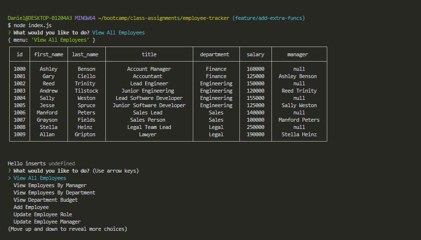

# employee-tracker

## Description
  
To keep track of a large company with many different employees, roles, and departments, I took on the challenge of building an application that could perform routine CRUD operations on our database. Now instead of having to update information within MYSQL itself, we can update important information from the command line without having to use sql syntax. I learned how to perform CRUD operations on a relational database, different commands in sql, and how to implement async/await and promise based functions.

- [Installation](#installation)
- [Usage](#usage)
- [Contribute](#contribute)
- [Tests](#tests)
- [Link](#link)
- [Questions](#questions)

## Installation
  
At the command line, clone this repository into your directory of choice and install the inquirer and mysql2 dependicies. Make sure you have your own MYSQL server installed.

## Usage
  
At the command line, run node index.js and use the arrow keys to choose between options. Input information when called for or select options you would like to view, update, or delete.

## Contribute
  
No contributions necessary, but tips on improving my code are welcome.

## Tests
  
No tests have been written for this project yet.

## Link

https://watch.screencastify.com/v/MSek8uK7TkKlmMPU2ONb

## Questions

Username: DanielTBonn
Github: https://github.com/DanielTBonn/
Email: danieltbonn@gmail.com